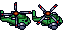
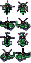
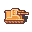
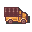

<div align="center">
  
  <h1>PipeFrame</h1>
  <p>A work-in-progress C++ simulation engine and editor built with C++20, SDL3, ImGui, and a custom ECS.</p>
</div>

<hr>

<h4 align="center">
  <a href="#purpose">Purpose</a>
  |
  <a href="#features">Features</a>
  |
  <a href="#requirements">Requirements</a>
  |
  <a href="#getting-started">Getting Started</a>
  |
  <a href="#controls">Controls</a>
  |
  <a href="#project-structure">Project Structure</a>
</h4>

<div align="center"><p>
  <a href="https://github.com/Doan-MHV/PipeFrame">
    
  </a>
  <a href="https://github.com/libsdl-org/SDL">
    
  </a>
  <a href="https://cmake.org/">
    
  </a>
  <a href="https://vcpkg.io/">
    
  </a>
  <a href="https://github.com/Doan-MHV/PipeFrame/commits/main">
    
  </a>
  <a href="https://github.com/Doan-MHV/PipeFrame">
    
  </a>
</p></div>

PipeFrame is a custom C++ simulation engine and editor for authoring interactive scenarios, experimenting with physics-driven entities, and prototyping learning-based behavior. The project currently combines a custom ECS, an SDL3 runtime, an ImGui editor shell, JSON-authored content, and native C++ gameplay/simulation systems.

The current 2D editor/runtime is the foundation. The long-term goal is to make the editor the source of truth for scenario content while keeping runtime simulation disposable, reproducible, and easy to reset.

<div align="center">
  
  
  
  
</div>

## Purpose

PipeFrame started as a small 2D game-engine learning project, but the direction is shifting toward simulation tooling.

The engine is intended to become a place to build and reset scenarios such as cars, planes, rockets, rigid-body boxes, and multi-agent simulations. Future work will focus on physics, scenario authoring, visualization/debug tools, and eventually reinforcement-learning style experiments.

Today, the project is still in the foundation stage. The editor, ECS, serialization, Play/Edit separation, and native simulation systems are being built first so later physics and agent systems have a stable place to live.

## Features

- Custom ECS with entities, tags, groups, systems, and component pools.
- SDL3 runtime loop with fixed-timestep-style frame pacing.
- ImGui editor shell with docked Toolbar, Hierarchy, Viewport, Tile Palette, and Inspector panels.
- Edit and Play engine modes with both `F1` and toolbar Play/Stop controls.
- Scene rendering to an off-screen texture displayed inside the editor viewport.
- JSON-driven scenario/content pipeline:
  - `projects/JungleDemo/PipeFrameProject.json`
  - `projects/JungleDemo/assets/AssetManifest.json`
  - `projects/JungleDemo/assets/levels/Level1.json`
  - `.map`
  - `.terrain`
  - `.entities.json`
- Tilemap editing and terrain painting inside the editor.
- Stable authored entity ids through `PersistentIdComponent`.
- Runtime systems for movement, animation, collisions, projectiles, damage, text, and health bars.
- Native C++ simulation/gameplay systems for project-specific behavior.

## Current Status

Implemented and working now:

- SDL3 + ImGui editor shell
- Play/Edit mode flow
- JSON level loading
- Separate tile visual map and terrain map
- Entity save/load through `.entities.json`
- In-memory authored world snapshot capture/restore work in progress
- Native Play-mode simulation update phases
- C++ ant forage system scaffold for simulation experiments

Still evolving:

- Full authored-world vs runtime-world separation
- Inspector polish and richer entity editing
- C++ project-module authoring workflow
- Physics and simulation-specific components
- More cleanup around project loading and editor/runtime boundaries
- More native systems, validation, and content tooling

## Requirements

- C++20 compiler
- CMake `4.1+`
- Git
- vcpkg

Project dependencies are declared in [`vcpkg.json`](/Users/vodoanminhhieu/Projects/Simulation/PipeFrame/vcpkg.json).

Current manifest dependencies include:

- SDL3
- SDL3_image
- SDL3_ttf
- glm
- nlohmann-json
- Dear ImGui

## Getting Started

### 1. Clone the project

```sh
git clone https://github.com/Doan-MHV/PipeFrame.git
cd PipeFrame
```

### 2. Install vcpkg

<details open>
<summary>macOS</summary>

```sh
git clone https://github.com/microsoft/vcpkg.git
cd vcpkg
./bootstrap-vcpkg.sh
```

Optional: make `vcpkg` easy to call everywhere.

```sh
export VCPKG_ROOT="$HOME/vcpkg"
export PATH="$VCPKG_ROOT:$PATH"
```

</details>

<details open>
<summary>Windows (PowerShell)</summary>

```powershell
git clone https://github.com/microsoft/vcpkg.git
cd vcpkg
.\bootstrap-vcpkg.bat
```

Optional: set `VCPKG_ROOT` so CMake and IDEs can find it more easily.

```powershell
$env:VCPKG_ROOT="C:\src\vcpkg"
```

</details>

### 3. Build with CMake

#### macOS / Linux

```sh
cmake -S . -B build -DCMAKE_BUILD_TYPE=Debug -DCMAKE_TOOLCHAIN_FILE="$VCPKG_ROOT/scripts/buildsystems/vcpkg.cmake"
cmake --build build
./build/PipeFrame
```

To open a specific project file:

```sh
./build/PipeFrame projects/JungleDemo/PipeFrameProject.json
```

#### Windows (PowerShell)

```powershell
cmake -S . -B build -DCMAKE_BUILD_TYPE=Debug -DCMAKE_TOOLCHAIN_FILE="$env:VCPKG_ROOT\scripts\buildsystems\vcpkg.cmake"
cmake --build build --config Debug
.\build\Debug\PipeFrame.exe
```

### 4. Build in CLion

Open the project in CLion and point the CMake profile at the vcpkg toolchain:

```text
-DCMAKE_TOOLCHAIN_FILE=/path/to/vcpkg/scripts/buildsystems/vcpkg.cmake
```

On Windows, use the full Windows path instead.

Then build and run the `PipeFrame` target.

You can pass a project file as the first program argument, for example:

```text
/absolute/path/to/PipeFrame/projects/JungleDemo/PipeFrameProject.json
```

## Controls

> Gameplay input is only active in Play mode.

- `F1`: toggle Edit / Play
- Toolbar `Play` / `Stop`: toggle Edit / Play
- `W`, `A`, `S`, `D`: move player in Play mode
- `Space`: fire projectile in Play mode
- `M`: toggle collider debug rendering
- `Esc`: quit

## Project Structure

<pre>
PipeFrame
|-- engine
|   |-- CMakeLists.txt
|   `-- src
|       |-- AssetStore
|       |-- Components
|       |-- ECS
|       |-- EventBus
|       |-- Events
|       |-- Game
|       |-- Logger
|       |-- Map
|       |-- Project
|       |-- Simulation
|       `-- Systems
|-- editor
|   |-- CMakeLists.txt
|   `-- src
|       `-- Editor
|           `-- Inspector
|-- apps
|   `-- PipeFrameEditor
|       |-- CMakeLists.txt
|       `-- src
|           |-- App
|           `-- Main.cpp
|-- projects
|   `-- JungleDemo
|       |-- PipeFrameProject.json
|       `-- assets
|           |-- AssetManifest.json
|           |-- fonts
|           |-- images
|           |-- levels
|           |-- sounds
|           `-- tilemaps
|   `-- AntSimulationDemo
|       |-- PipeFrameProject.json
|       |-- Source
|       |   |-- CMakeLists.txt
|       |   `-- src
|       |       |-- Components
|       |       |-- Simulations
|       |       `-- Systems
|       `-- assets
|-- CMakeLists.txt
`-- vcpkg.json
</pre>

## Native Simulation Notes

PipeFrame is now C++ first. Project behavior should move into native systems, services, and components rather than browser-language files.

The current extension example is AntSimulationDemo's C++ module:

- [`AntSimulationModule.cpp`](/Users/vodoanminhhieu/Projects/Simulation/PipeFrame/projects/AntSimulationDemo/Source/AntSimulationModule.cpp)
- [`AntColonyComponent.h`](/Users/vodoanminhhieu/Projects/Simulation/PipeFrame/projects/AntSimulationDemo/Source/Components/AntColonyComponent.h)
- [`FoodSourceComponent.h`](/Users/vodoanminhhieu/Projects/Simulation/PipeFrame/projects/AntSimulationDemo/Source/Components/FoodSourceComponent.h)
- [`AntSwarmComponent.h`](/Users/vodoanminhhieu/Projects/Simulation/PipeFrame/projects/AntSimulationDemo/Source/Components/AntSwarmComponent.h)
- [`Colony.h`](/Users/vodoanminhhieu/Projects/Simulation/PipeFrame/projects/AntSimulationDemo/Source/Entity/Colony.h)
- [`FoodSource.h`](/Users/vodoanminhhieu/Projects/Simulation/PipeFrame/projects/AntSimulationDemo/Source/Entity/FoodSource.h)
- [`AntSwarm.h`](/Users/vodoanminhhieu/Projects/Simulation/PipeFrame/projects/AntSimulationDemo/Source/Entity/AntSwarm.h)
- [`AntSwarmSimulation.h`](/Users/vodoanminhhieu/Projects/Simulation/PipeFrame/projects/AntSimulationDemo/Source/Simulations/AntSwarmSimulation.h)

## Architecture Notes

The project is moving toward this split:

- **Authored editor state**
  - entities
  - tilemap
  - terrain
  - unsaved edits

- **Runtime play state**
  - disposable simulation copy
  - projectiles
  - health changes
  - AI/simulation state

The editor should preserve authored work and throw away Play-mode mutations when returning to Edit mode.

## Direction

The next major direction is simulation-first tooling:

- physics components and debug visualization
- repeatable scenario reset for experiments
- native agents and parameterized C++ systems
- scenario templates for vehicles, projectiles, rigid bodies, and agent groups
- long-term reinforcement-learning hooks for observation, action, reward, and reset loops
