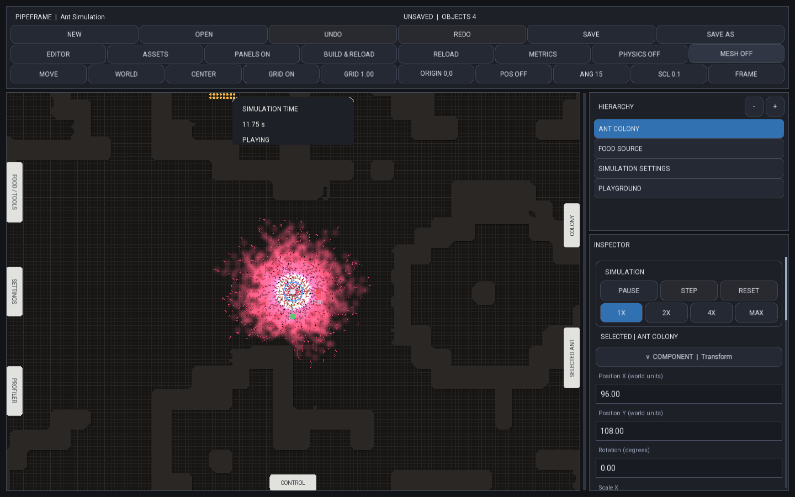
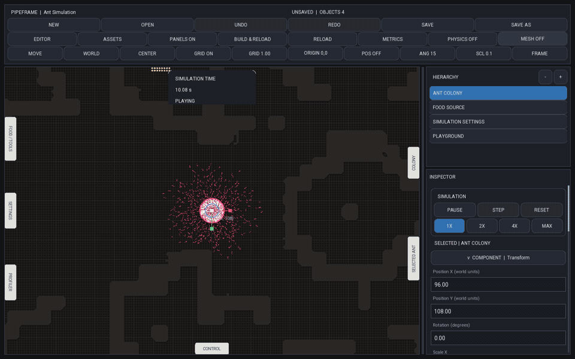
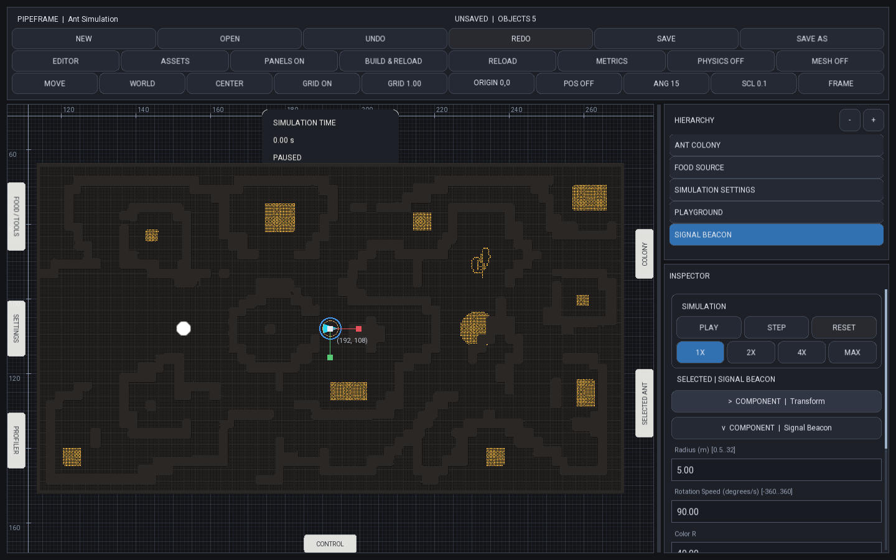
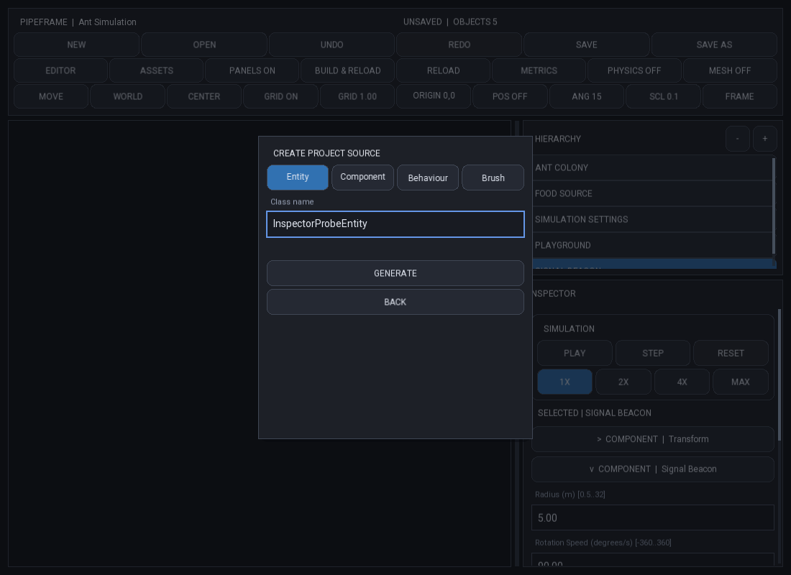
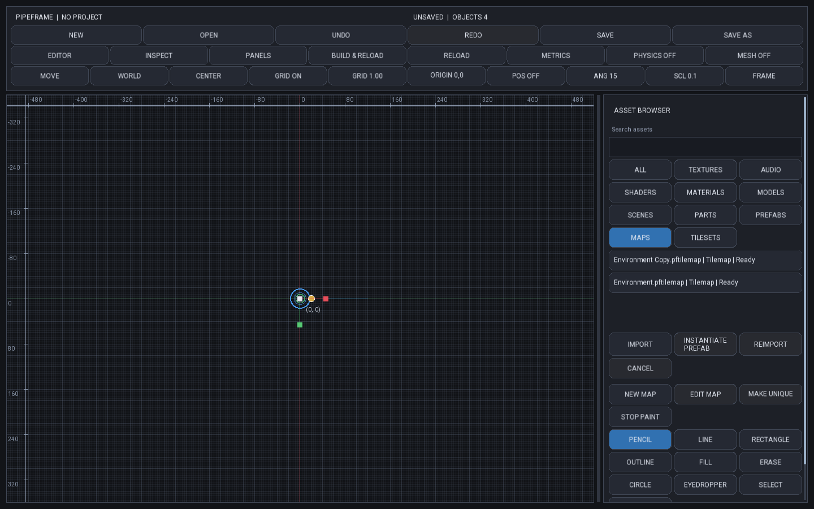

# PipeFrame

**A C++20 simulation engine and desktop editor.**

PipeFrame gives simulation projects a shared home: scenes, entities, editable components,
physics helpers, rendering, UI, and the tools to put them together. The idea is simple:
spend more time writing the simulation and less time rebuilding the editor around it.



*The PipeFrame editor, shown here with the separate Ant simulation project loaded.*

## See it running



*A live simulation inside the editor, with the shared physics overlay switched on and off.*

## Two projects, one repo

| Project | What it focuses on |
| --- | --- |
| **PipeFrame** — this page | The reusable engine, desktop editor, project tooling, and UI library. |
| **[Ant](examples/AntSimulation/README.md)** | A colony simulation built on PipeFrame: foraging, pheromones, collisions, custom rendering, and editor tools. |

Other experiments live in this repo too. These are the two projects featured here.

## What you can do

- **Build scenes visually.** Create objects, move them with gizmos, edit their components, and save your work with undo/redo.
- **Expose your own fields.** Component schemas define editable values, read-only telemetry, labels, and validation in one place.
- **Make environments.** Create playgrounds and tilemaps, paint terrain, work with textures/materials, and add project-specific brushes.
- **Write UI with reusable views.** Compose rows, columns, buttons, scroll areas, and stateful views through a declarative C++ API.
- **Inspect a running simulation.** Play, pause, step, change speed, and switch on physics or mesh outlines.
- **Start another project.** New Project generates world modules and a host adapter. Source generation and Build & Reload connect new types to the editor.

## A closer look at the editor

### Components that explain themselves

Select an entity and the Inspector shows its registered components. Each component
owns its field schema: names, types, defaults, limits, and whether a value is editable
or read-only. That same metadata drives the editing workflow, so a project doesn't
need to build a custom panel for every new component.



*Ant's Signal Beacon is a small example: its radius, rotation speed, and color appear
in the shared Inspector alongside Transform.*

### Project setup and source generation

The editor can generate entities, components, behaviours, and brushes. Generated types
follow the project conventions and feed into registration; **Build & Reload** compiles
the project library and loads it into the workbench. Systems are still registered
explicitly with their world so their update order stays easy to follow.



*The source-generation dialog creates the starting code. The project then supplies
its own data and logic.*

### Assets and environments

The asset browser separates textures, shaders, materials, maps, tilesets, and other
asset categories. Tilemap tools include pencil, line, rectangle, fill, and erase.
Projects can add schema-driven brushes, such as Ant's food-density brush, without
putting simulation-specific rules into the editor itself.



*An editor test scene showing map assets and brush controls. Imported resources,
scene objects, and the map document have separate editing responsibilities.*

## How the engine is organized

Projects use entities and components for data, behaviours for attached logic, and
systems for work over many entities. World modules give that code a predictable place:

```text
Source/
├── World/
│   ├── ProjectWorld.h
│   ├── Physics/       # Solvers and movement systems
│   ├── Rendering/     # Textures, geometry, and render layers
│   └── Runtime/       # Simulation rules and world state
├── Components/        # Data and Inspector schemas
├── Entities/          # Object composition
├── Behaviours/
├── Systems/
├── Editor/            # Project UI and authoring tools
└── Runtime/           # Connection to the editor and project lifecycle
```

The default scene runtime includes sprite rendering and kinematic collision handling.
Projects can replace those paths with their own physics and rendering inside their
worlds, as Ant does. Custom worlds submit debug geometry through the same editor controls.

SFML handles the native backend. Project-facing drawing and UI use PipeFrame APIs,
so projects don't need to build directly against SFML widgets or drawing types.

## Engineering behind it

| Area | Approach |
| --- | --- |
| Runtime | ECS-backed scenes, attached behaviours, and ordered fixed-step systems. |
| Rendering | Backend-neutral Canvas, render layers, typed texture resources, and batched sprite geometry. |
| Physics | Kinematic movement, primitive colliders, tilemap queries, and reusable collision helpers. |
| UI | Declarative views with shared layout, state, scrolling, and input handling. |
| Tooling | Generated projects, component registration, runtime-library builds, and reload support. |
| Verification | Engine tests, native editor interactions, deterministic simulation checks, and blank-project acceptance. |

A lot of the work has been about making these pieces agree: an Inspector edit needs
to reach the real component, a painted wall needs to affect collision queries, and
a custom project needs to survive save, reopen, and rebuild. Ant exercises those
connections in a running simulation rather than only in isolated demos.

## Build and try it

Developed and tested on macOS. You need a C++20 compiler, CMake 3.25+, Ninja, and
[vcpkg](https://github.com/microsoft/vcpkg). Set `VCPKG_ROOT` to your vcpkg checkout;
the repository manifest installs SFML 3 and nativefiledialog-extended.

```sh
cmake --preset release \
  -DCMAKE_TOOLCHAIN_FILE="$VCPKG_ROOT/scripts/buildsystems/vcpkg.cmake" \
  -DPIPEFRAME_ANT_REWORK_ONLY=ON
cmake --build --preset release
./cmake-build-release/apps/SimulationWorkbench/SimulationWorkbench
```

Choose **New** to create a project, or **Open** and select
`examples/AntSimulation/project.pipeframe`. Use **Build & Reload** to load its runtime.
The build flag above selects the current engine/Ant development scope.

```sh
ctest --test-dir cmake-build-release --output-on-failure
```

The current Release suite has 80 tests covering engine behavior, editor interactions,
generated-project builds, save/reopen, and Ant regression checks.
[Latest recorded verification](docs/rework/evidence/ant-runtime-cleanup/README.md).

## A few useful places to start

- [Create a blank project](docs/tutorials/blank-project/README.md)
- [World architecture and custom debug drawing](docs/rework/GENERATED_PROJECT_WORLDS.md)
- [Component schemas and validation](docs/rework/COMPONENT_SCHEMA_CONVENTION.md)
- [Declarative UI example](docs/tutorials/independent-ui/README.md)
- [Ant project](examples/AntSimulation/README.md)

PipeFrame is an actively developed 2D simulation toolkit. The current physics defaults
are kinematic; a general dynamic rigid-body solver and 3D editor are outside this showcase.
