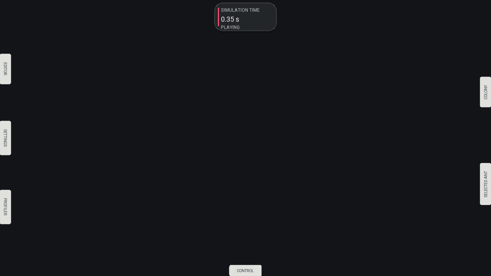
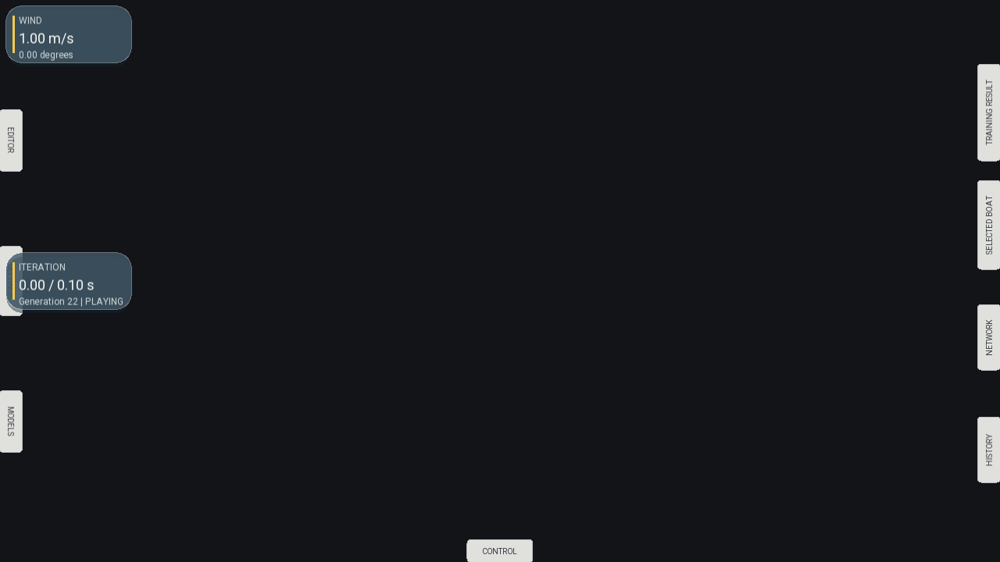
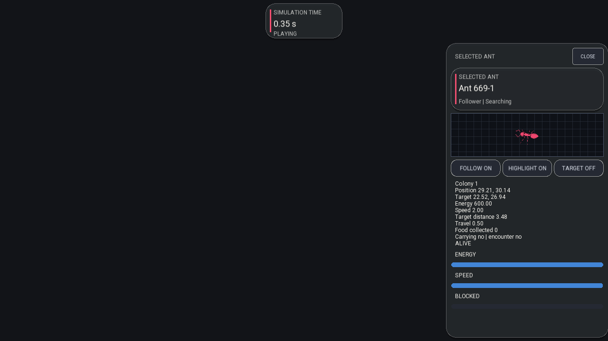
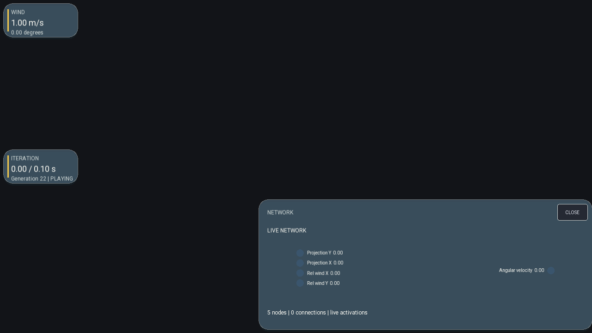
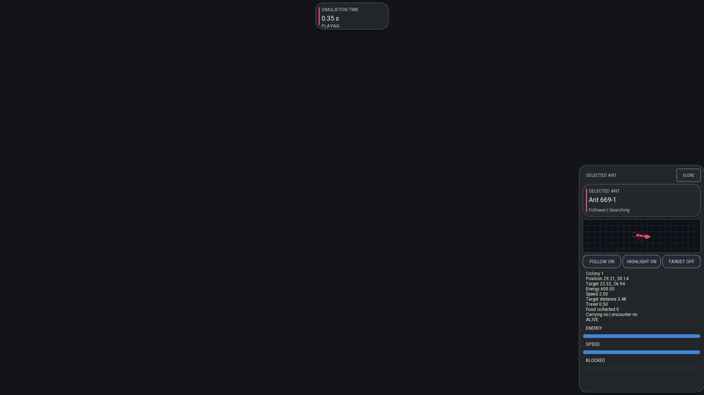
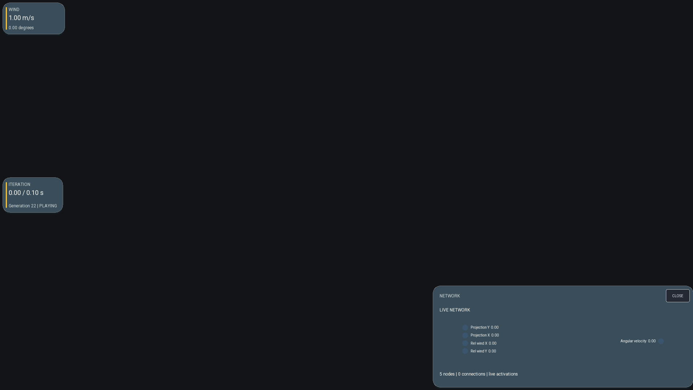
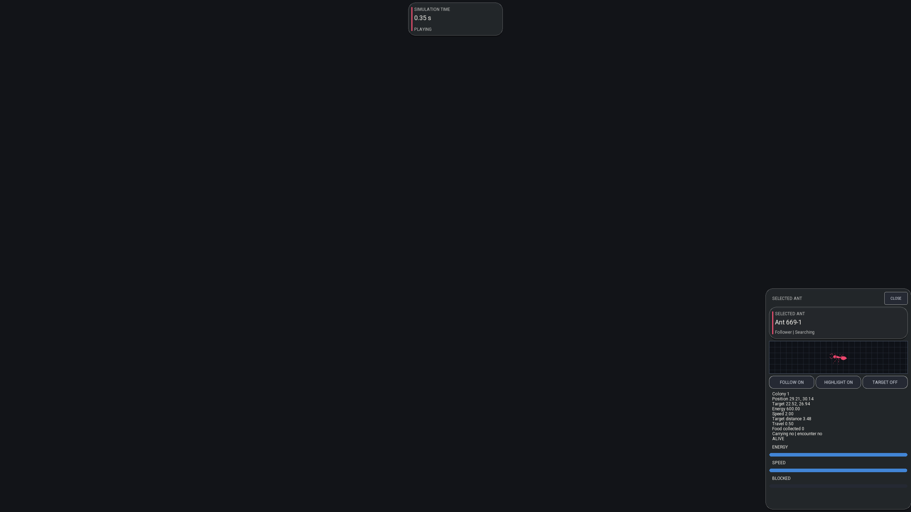
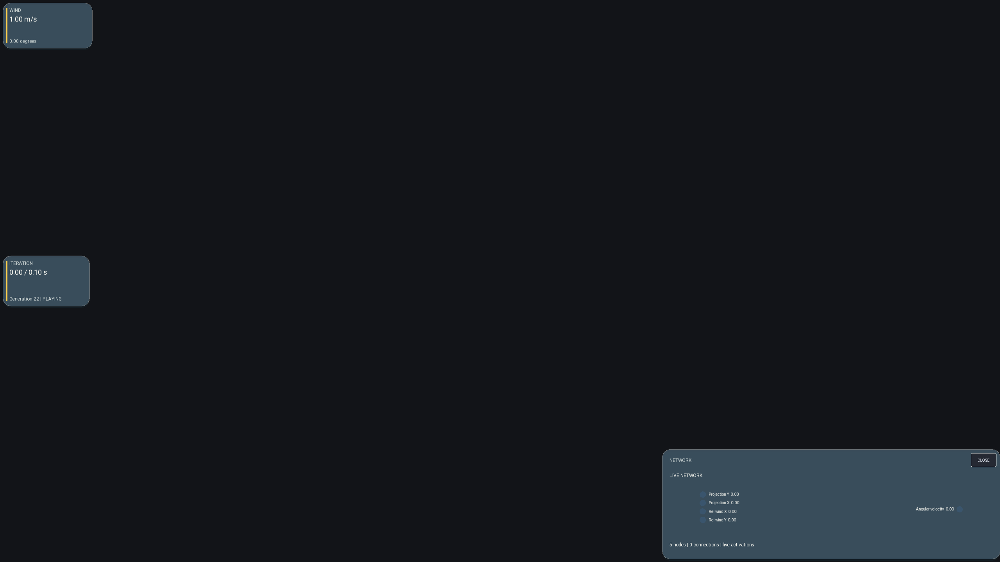
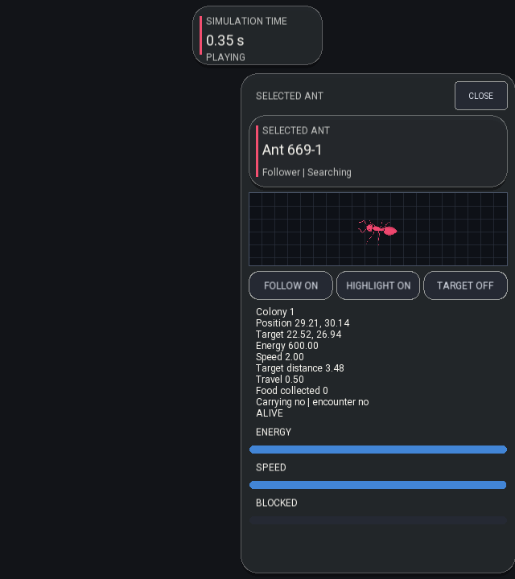
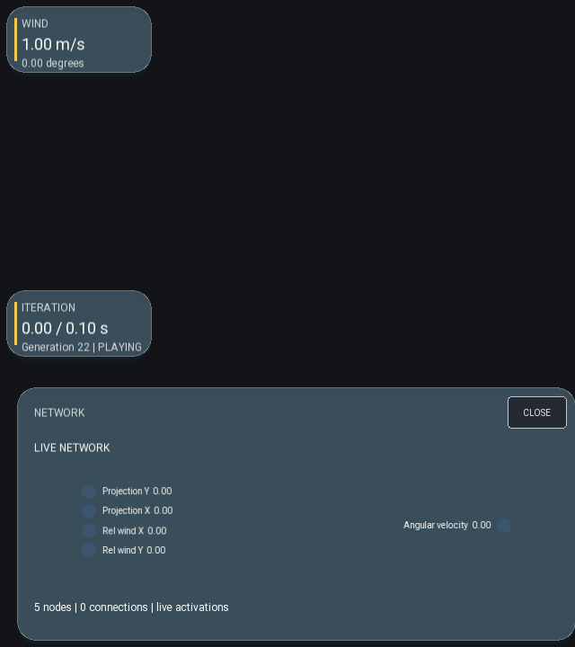

# Milestone 17I comparison board

Status: **accepted**

The Pezzza reference frames and source layout contracts are indexed in
[`references/README.md`](references/README.md). The current captures below are
generated by `SimulationDashboardTests`; each run exercises the live Ant and
SailBoat runtimes before rendering the requested UI state.

## Collapsed launch state

| Ant | SailBoat |
|---|---|
|  |  |

## 720p

| Ant | SailBoat |
|---|---|
|  |  |

## 1080p

| Ant | SailBoat |
|---|---|
|  |  |

## 1440p

| Ant | SailBoat |
|---|---|
|  |  |

## Narrow layout

| Ant | SailBoat |
|---|---|
|  |  |

## Review result

- The single full-height tab dashboard is absent from both applications.
- Timer, editor/settings, entity/result, network, profiler/history, and control
  surfaces have independent compact white buttons in the collapsed state.
- Activating a button hides all drawer buttons and displays one complete popup
  with a CLOSE action. Opening another popup closes the previous one, preventing
  popup-to-popup and tab-to-popup overlap.
- Buttons on the same edge occupy separate fixed slots. Collapsed drawer bodies
  and scroll surfaces are excluded from hit testing, so each visible button owns
  its complete click target.
- Popup widths no longer shrink below their authored content width. Fixed-height
  rows therefore do not wrap into adjacent controls at narrow viewport sizes.
- Ant uses smoked neutral glass with its pink colony/selection accent. SailBoat
  uses blue-grey glass with the reference warm-yellow training accent.
- SailBoat's network presents named inputs and output, live values, signed edge
  colors, weighted edge thickness, and independently expandable topology.
- Essential selected-ant, colony, selected-boat, result, network, and transport
  information fits inside its popup without intersecting adjacent rows. Long
  history/model workflows retain local scrolling.
- Pointer capture, keyboard focus, hover lift, pressed/selected states, eased
  drawer motion, Zen release, and resize reachability are covered by automated
  interaction assertions.

YouTube compression and camera motion make a raw whole-frame pixel threshold
misleading. Review therefore treats the stable HUD geometry, palette, hierarchy,
and interaction end states as the comparison regions, with deterministic local
captures retained above.
