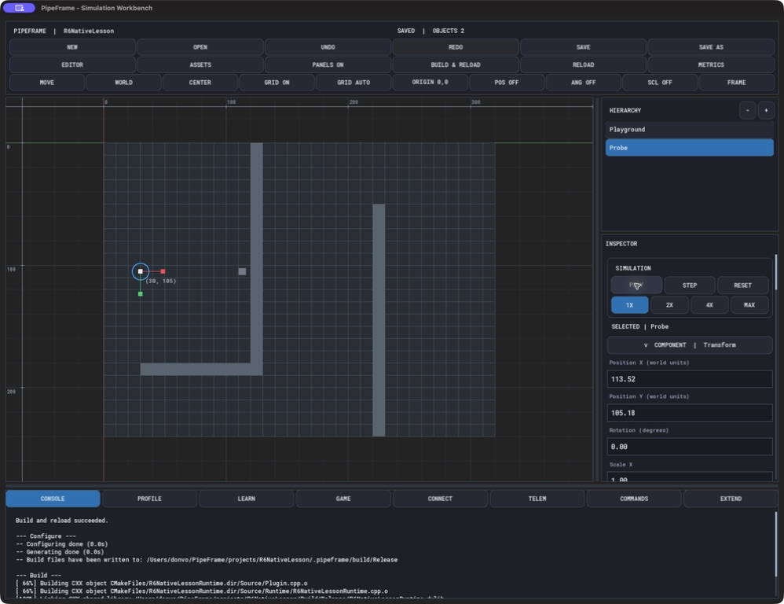

# R6 blank-project acceptance and learning documentation

September 13, 2026. **Package 8 complete**: integrated acceptance and learning documentation.
**Overall R6 is now verified**: the subsequent [collision workspace optimization and
ABI 12 three-run verification](R6_FINAL_PERFORMANCE.md) close the performance miss
recorded below. This page preserves package 8's earlier ABI 11 evidence. R7 is separate.

## Delivered

- [Step-by-step learning guide](../tutorials/blank-project/README.md), with compiled
  [settings](../tutorials/blank-project/ProbeSettings.h) and
  [behaviour](../tutorials/blank-project/ProbeBehaviour.h) examples.
- [BlankProjectAcceptanceTests](../../apps/SimulationWorkbench/tests/BlankProjectAcceptanceTests.cpp)
  creates a genuinely empty project, generates types, builds its plugin, authors its map
  through the editor gesture controller, and completes a full save/reopen/reload sequence.
- Scene-local `Behaviour::GetService<T>()` and the backend-neutral `EnvironmentQueries`
  contract let generated behaviour consume the existing scene collision service without
  a custom runtime bridge. The generated SceneProjectRuntime installs the service.
  The registry is borrowed and scene-local, survives scene reset, and adds no per-entity
  registry. Plugin ABI is now **11**; rebuild existing project plugins.

## Evidence coverage

| Workflow | Integrated editor API acceptance | Native interaction evidence |
| --- | --- | --- |
| New empty project, standard structure, build | Checked | `native-01-empty.jpg`, successful toolbar build |
| Playground, assigned empty map, line-painted maze | Checked | `native-02-new-map.jpg`, `native-03-maze.jpg` |
| Whole-stroke undo/redo and map save | Checked | `native-04-undo.jpg`, restored and saved through map tools |
| Material, obstacle, spawn and goal markers | Checked | Not separately replayed in this native walkthrough |
| Generate entity/settings/behaviour and attach properties | Exact guide code compiled | `native-05-generated.jpg`, `native-06-properties.jpg` |
| Query-driven movement and live telemetry | Checked against actual plugin | `native-07-blocked.jpg`, `native-08-visible-probe.jpg` |
| Pause/reset | Frozen pose and restored defaults checked | Native buttons exercised; authored pose restored |
| Prefab, save/reopen, subsequent rebuild/reload | Checked | Toolbar rebuild captured in `native-09-rebuild.jpg`; prefab/reopen covered by integrated acceptance |
| Invalid settings and read-only writes | Rejected with state retained | Schema controls visible |
| Ant authored environments | Existing Ant acceptance rerun in full suite | Retained [Ant native walkthrough](R6_ANT_ENVIRONMENT_AUTHORING.md) |
| Compiler failure, cancellation, invalid plugin recovery | Existing build/loader acceptance retained | Earlier [build workflow evidence](R6_BUILD_WORKFLOW.md) |

Native captures are in [evidence/r6-blank-project](evidence/r6-blank-project/).
The native project is `projects/R6NativeLesson`; its map was painted in the editor,
not written by an external image/script generator. Its two project source files were
edited as a developer normally edits generated code. A mistyped unused generated component
was removed, with its module/registration metadata, before the successful final rebuild.
The complete project is also retained in `projects/R6LearningArena` (six objects,
material, map, prefab and compiled project sources). The automated scenario is reproducible by running the acceptance executable
with a fresh destination directory. It uses editor APIs rather than scripting scene files.

The initial integrated attempt exposed a test-harness assumption: setting collision
true when already true correctly returns “no change.” The fixture now avoids treating
that no-op as a mutation failure. The exploratory log and subsequent passing log are
retained; no product check was disabled.

## Boundaries

Spawn/Goal are named visual markers; this example does not implement pathfinding.
The Probe uses a noncolliding visible environment shape and a separate kinematic body.
Raycasts are geometric queries, not a physical sensor model. The authored selection gizmo
can stay at the authored position during play; live pose and the rendered marker show
simulation movement. The generic service does not replace Ant's specialized world solver.
The guide documents these distinctions rather than presenting descriptor-only rendering,
automatic execution of arbitrary new files, or robotics features as implemented.

## Final verification

- Final Debug build and **77/77 tests passed**: [log](evidence/r6-blank-project/debug-tests.txt).
- Final Release build and **77/77 tests passed**: [log](evidence/r6-blank-project/release-tests.txt).
- This includes BlankProjectAcceptance, AntEnvironmentAuthoringAcceptance, component
  validation, build failure/reload recovery, public header boundaries, Ant parity and stress.
- A separately retained complete project also passed: [log](evidence/r6-blank-project/retained-project.txt).
- `git diff --check` passed; Ant Source scan found no SFML, `sf::`, or backend references.
- [Final source hashes](evidence/r6-blank-project/source-sha256.json) and the performance
  runner's executable hash identify the tested working-tree content; no clean Git revision
  or new commit is claimed.

The final ABI 11 [three-run performance recheck](evidence/r6-blank-project/performance/results.json)
returned failure because run 3 exceeded the unchanged five-colony p95 budget. No failed
run was discarded, no retry was substituted, and no population/quality/timestep target
was reduced.

| p95 frame time (ms) | Run 1 | Run 2 | Run 3 | Budget |
| --- | ---: | ---: | ---: | ---: |
| 1 colony | 5.395 | 5.180 | 5.114 | 16.67 |
| 3 colonies | 11.113 | 11.082 | 11.339 | 16.67 |
| 5 colonies | 16.521 | 16.241 | **16.707 — fail** | 16.67 |

All paused editor/scroll/drag and map frame/input/load/save/memory fixtures passed in
all three runs. Live colony counts were unchanged at 999/3023/4832. The small five-colony
miss is a measured lack of headroom, not proof that scene services caused a slowdown.
That required follow-up is now complete: [ABI 12 final verification](R6_FINAL_PERFORMANCE.md)
passes all three runs after the workspace optimization. The package 8 workflow, documentation, and correctness
acceptance are complete; robotics features and R7 cleanup remain separate work.
