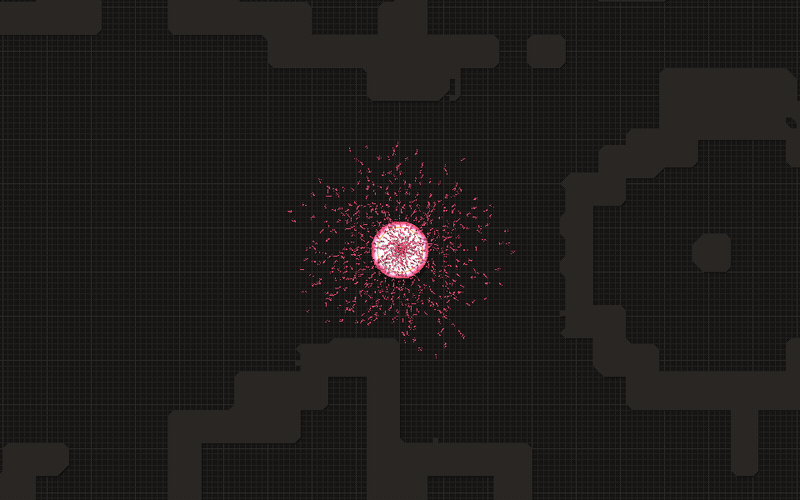
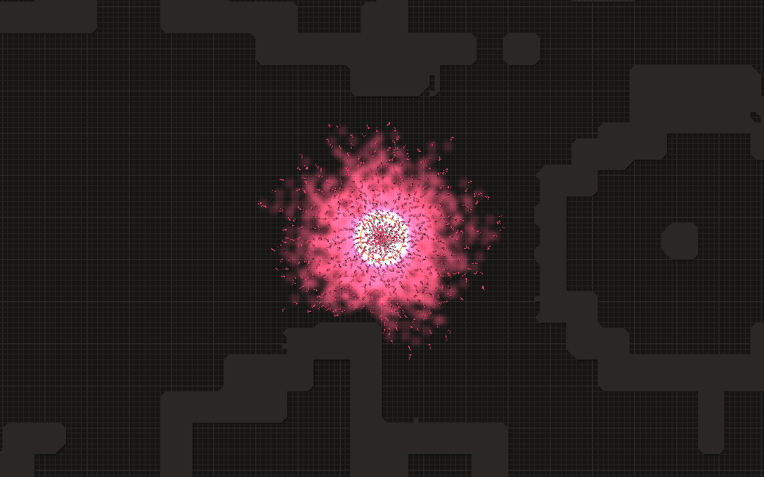
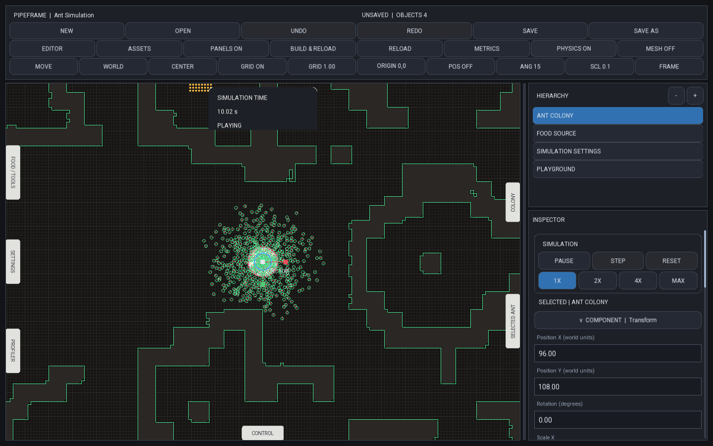
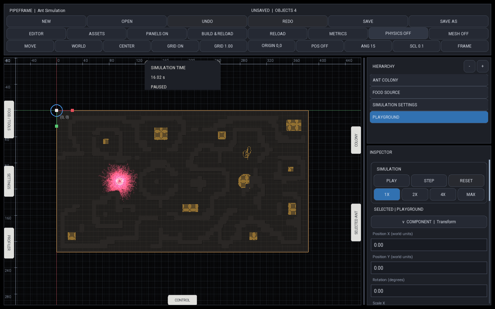
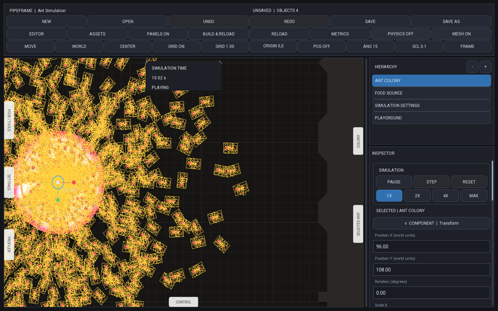

# Ant

**An interactive ant-colony simulation built on [PipeFrame](../../README.md).**

Ants leave the colony, explore the map, find food, and bring it home. Pheromone trails
connect those individual decisions into visible paths. You can edit the environment,
add food while it runs, and follow an ant to see what it is doing.



*Captured from the running simulation. The trails and ant movement are simulated, not a pre-made animation.*

## What makes this a separate project?

PipeFrame supplies the engine and editor. Ant supplies the colony rules, foraging
behaviour, pheromone fields, specialized physics/rendering, and simulation-specific tools.
It also serves as a working example of how to build a larger project on the engine.



## Things to try

- **Watch the colony forage.** Ants search for food, follow trails, return deliveries, and interact with the colony's reserves and population.
- **Change the map.** Paint walls and starting food into an editor-authored tilemap.
- **Feed them while they run.** Open **FOOD / TOOLS**, choose **Add Food**, and right-drag in the world. This changes the live run; reset restores the authored scene.
- **Follow one ant.** Inspect its state, energy, speed, target, and food delivery data.
- **Look underneath the visuals.** Toggle **PHYSICS** for body circles and wall boundaries, or **MESH** for triangle edges. Zoom in to see the detailed ant mesh.



*Green outlines show the physics bodies and wall boundaries used by the simulation.
The overlay can be hidden without disabling collisions.*

## From individual ants to colony behaviour

Each ant has its own state: position, movement, energy, target, and foraging data.
Systems update those components in batches. Ants sample their surroundings and
pheromone fields, move toward their targets, and bring collected food back to the
colony. The environment stores the shared food and marker fields that connect
those individual updates.

The simulation uses a fixed timestep. Movement and contact resolution produce the
positions used by the next stages; the renderer then turns the resulting state into
ant geometry, shadows, and visible trails. Pausing and stepping make it possible to
inspect that process one update at a time.

## The environment is part of the project

The map is an editable tilemap asset attached to a Playground. Walls become collision
cells, while food quantities live in a separate data layer. The custom food brush
writes that data through the editor's brush API.



*The full environment, its food patches, and the colony are visible in the same scene
used by the simulation.*

There are two useful editing workflows:

| Change | Use it for |
| --- | --- |
| Paint and save the map | Define the starting terrain and food distribution for a repeatable run. |
| Paint food during play | Try a new situation immediately and watch how the ants respond; reset returns to authored data. |

## Seeing the geometry

Ants use textured geometry for their bodies and legs. The renderer builds batches
and changes detail with zoom: detailed parts up close, simpler quads farther away,
and points at the lowest detail level. This keeps the rendering path useful at
different population sizes and camera distances.



*The MESH overlay exposes the triangles behind the ant textures. Dense areas look
busy because the view shows the geometry of every rendered ant.*

## Under the hood

- **ECS-backed state:** ant and colony components are read by simulation systems and exposed through the Inspector.
- **Fixed-step simulation:** ordered colony, movement, behaviour, and cleanup phases, with deterministic replay checks.
- **Spatial collision queries:** circle bodies, wall sweeps, contact resolution, and reusable spatial storage.
- **Batched rendering:** textured body and leg geometry, pheromone visualization, and detail levels based on zoom.
- **Custom editor tools:** a food-density brush, live food painting, colony settings, and individual-ant inspection.

```text
Source/World/
├── AntWorld.h / .cpp       # World ownership and simulation phases
├── Physics/               # Bodies, avoidance, movement, and contacts
├── Rendering/             # Ant meshes, environment, shadows, and debug views
└── Runtime/               # Colony rules, foraging, environment, and scene construction
```

Components define their fields and validation alongside their data. The outer
`Source/Runtime/` connects Ant to the editor; simulation logic lives inside `World/`.

## What the integration work involved

The main challenge was keeping the simulation working while making it a reusable
engine example. That meant moving state into components, giving systems a clear
world owner, connecting schemas to the Inspector, replacing the temporary image-map
workflow with editable assets, and routing rendering through PipeFrame's public APIs.

Performance work includes reusing collision workspace and batching geometry instead
of rebuilding everything from scratch each frame. Regression tests cover simulation
behaviour, scene authoring, rendering, and replay; the linked performance reports record
their test conditions rather than promising one frame rate on every machine.

## Run it

Build PipeFrame using the [repository instructions](../../README.md#build-and-try-it),
then launch from the repository root:

```sh
./cmake-build-release/apps/SimulationWorkbench/SimulationWorkbench \
  --project examples/AntSimulation/project.pipeframe
```

Choose **Build & Reload**, then **Play**. Use the hierarchy to select the colony and
change its settings. **Pause**, **Step**, and **Reset** help inspect a run.

For saved food placement, select the Playground and use the map editor's
**Ant / Ant Food Density** brush. Save the map and scene, then reset.

## Credits and project work

The original simulation comes from **Pezzza's Work**. His source and demonstrations
are the reference for the ant behaviour and visual style.
The supplied [reference source](../../AntPezzaSource) is kept in this repository.

The work in this project focuses on adapting that simulation to PipeFrame's ECS and
world architecture, editor-authored environments, component inspection, custom brushes,
backend-neutral rendering, and performance/regression testing. It is not a claim that
the original simulation was invented here or that every detail matches the reference.
[Reference notes](PARITY.md).

## More detail

- [Development guide and source map](DEVELOPMENT.md)
- [Environment editing](../../docs/rework/R6_ANT_ENVIRONMENT_AUTHORING.md)
- [Recorded performance work](../../docs/rework/R6_FINAL_PERFORMANCE.md)
- [Latest regression and rendering verification](../../docs/rework/evidence/ant-runtime-cleanup/README.md)
